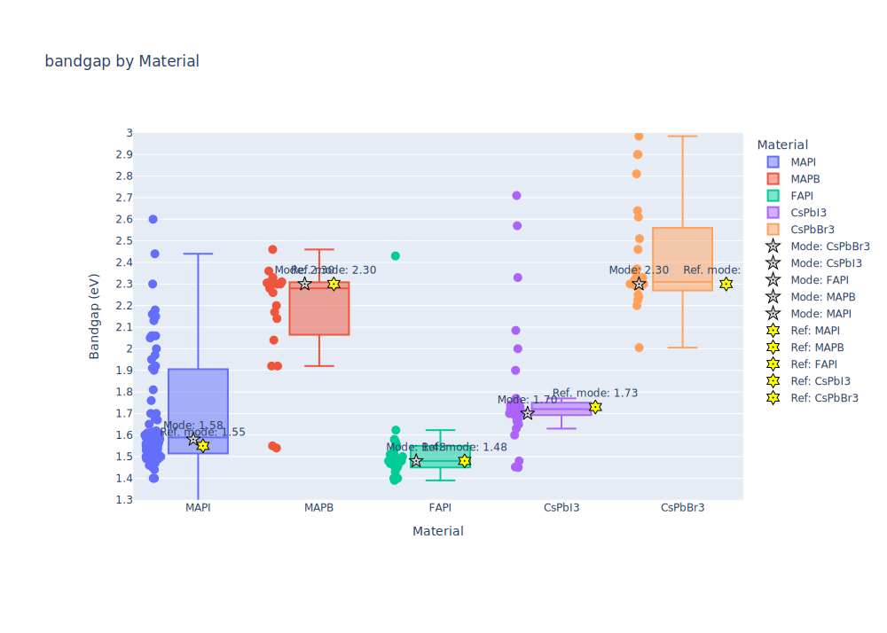
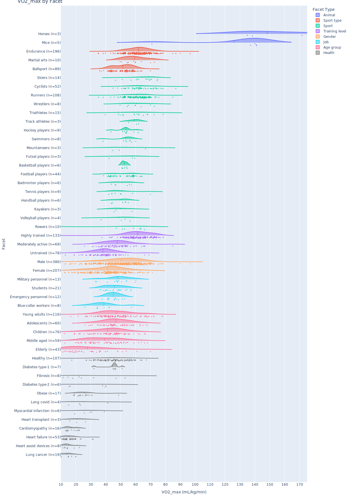

# Use Quinex as a Python library

## Installation

To use quinex as a **Python library** create a virtual environment (for example, via mamba), activate it
```bash
mamba create --name "quinex_env" python=3.9 -c conda-forge
mamba activate quinex_env
```
and then install quinex via pip:
```bash
pip install git+https://github.com/FZJ-IEK3-VSA/quinex.git
python3 -m spacy download en_core_web_md
```

## Use case 1: Extract quantitative information from a text

Then, you can use quinex as follows:
```python
>>> from quinex import Quinex

>>> quinex = Quinex()
>>> text = "Reykjanesvirkjun is a geothermal power station located in Iceland with a power output of 130 MW."

>>> qclaims = quinex(text)
[
    {
        'claim': {
            'entity': {
                'is_implicit': False,
                'start': 0,
                'end': 16,
                'text': 'Reykjanesvirkjun'
            }, 
            'property': {
                'is_implicit': False,
                'start': 73,
                'end': 85,
                'text': 'power output'
            }, 
            'quantity': {
                'is_implicit': False,
                'start': 89,
                'end': 96,
                'text': '130 MW',
                'normalized': { [...] 'numeric_value': 130 [...] }
        'qualifiers': {
            'temporal_scope': None, 
            'spatial_scope': {
                'text': 'Iceland',            
                'start': 58,
                'end': 65,
                'is_implicit': False
            }, 
            'reference': None, 
            'method': None,
            'qualifier': None
        }, 
        'statement_classification': {
            'type': 'observation',
            'rational': 'arbitrary',
            'system': 'real_world'
        }
    }
]
```
Also, see [`examples/basic_usage.ipynb`](../examples/basic_usage.ipynb).

By default, quinex extracts all quantities, including imprecise ones (e.g., "several turbines"). You can ignore them by setting `skip_imprecise_quantities=True`:
```Python
>>> qclaims = quinex(text, skip_imprecise_quantities=True)
```

When creating the `Quinex` instance, you can specify to use the `use_cpu=True`, the models to use (e.g., `quantity_model_name="/path/to/model`), disable certain tasks (e.g., `enable_qualifier_extraction=False`), specifiy the max. number of tokens to generate for each question answering step (e.g., `max_new_tokens=50`), which devices to use with how many workers and what batch size, and more. For details, please refer to the docstring of the [`Quinex` class](./src/quinex/inference/extract/pipeline). You can also use presets to define the models and tasks to perform:

```Python
>>> form quinex.config.presets import models, tasks
>>> quinex = Quinex(**models.tiny, **tasks.full)
```

## Use case 2: Identify quantities only
```python
>>> from quinex import Quinex

>>> # Disable other tasks to speed up initialization
>>> quinex = Quinex(
    enable_context_extraction=False,
    enable_qualifier_extraction=False,
    enable_statement_classification=False
)
>>> text = "After deposition at a substrate temperature of ≃ 300 °C, the sample was annealed in-situ at a temperature of ≃ 400 °C for 15 min."
>>> quantities = quinex.get_quantities(text, skip_imprecise_quantities=True)
>>> print([q["text"] for q in quantities])
['300 °C', '400 °C', '15 min']

>>> # Quantities are normalized to a standardized form
>>> print(quantities[0])
{
    'text': '300 °C', 
    'span': {'begin': 49, 'end': 55}, 
    'is_implicit': False,        
    'normalized': {
        'type': 'single_quantity', 
        'is_relative': False, 
        'individual_quantities': {
            'normalized': [
                {
                    'value': {'normalized': {'numeric_value': 300, 'is_imprecise': False, 'modifiers': '~', 'is_mean': None, 'is_median': None}, 'text': '300'}, 
                    'uncertainty_expression_pre_unit': None, 
                    'uncertainty_expression_post_unit': None, 
                    'unit': {
                        'text': {'prefixed': '', 'suffixed': '°C', 'ellipsed': ''}, 
                        'normalized': [{'text': '°C', 'exponent': 1, 'uri': 'http://qudt.org/vocab/unit/DEG_C', 'year': None}]
                    }
                }
            ]
        }
    }
}
```

Alternatively, you can also use the task preset for extracting only quantities
```Python
>>> form quinex.config.presets import models, tasks
>>> quinex = Quinex(**models.tiny, **tasks.quantities_only)
>>> quantities = quinex("...")
```

Or you can keep all tasks enabled and use the get_quantities() method.
```Python
>>> form quinex.config.presets import models, tasks
>>> quinex = Quinex()
>>> quantities = quinex.get_quantities("...")
```

## Use case 3: Parse numbers, units, and quantities
This use case is powered by the quantity and unit parser which we outsourced in a separate package. However, it is also installed as a dependency when installing quinex. For detailed instructions, refer to the repo of the [quinex-utils](https://github.com/FZJ-IEK3-VSA/quinex-utils) package.

Convert numbers from strings to numeric data types
```python
>>> from quinex import str2num
>>> num = str2num("3.23 10^3")
3230
>>> num = str2num("one million")
1e6
```

Parse unit strings
```python
>>> from quinex import FastSymbolicUnitParser
>>> unit_parser = FastSymbolicUnitParser()
>>> unit_parser.parse("$2021/kWh")
[
    ('$', 1, 'http://qudt.org/vocab/currency/USD', 2021),
    ('kWh', -1, 'http://qudt.org/vocab/unit/KiloW-HR', None)
]
```

Parse quantity strings
```python
>>> from quinex import FastSymbolicQuantityParser
>>> quantity_parser = FastSymbolicQuantityParser()
>>> quantity_parser.parse("above -120.123/-5 to 10.3 * 10^5 TWh kg*s^2/(m^2 per year)^3 at least")
{
    'type': 'range'
    'nbr_quantities': 2,
    'normalized_quantities': [
        {
            'prefixed_modifier': {'normalized': '>', 'text': 'above'},
            'prefixed_unit': None,
            'value': {
                'normalized': {'is_imprecise': False, 'numeric_value': 2402460.0},
                'text': '-120.123/-5'
                }
            'suffixed_modifier': {'normalized': None, 'text': None},
            'suffixed_unit': {
                'ellipsed_text': 'TWh kg*s^2/(m^2 per year)^3',
                'normalized': [
                    ('TWh', 1, 'http://qudt.org/vocab/unit/TeraW-HR', None),
                    ('kg', 1, 'http://qudt.org/vocab/unit/KiloGM', None),
                    ('s', 2, 'http://qudt.org/vocab/unit/SEC', None),
                    ('m', -6, 'http://qudt.org/vocab/unit/M', None),
                    ('year', 3, 'http://qudt.org/vocab/unit/YR', None)],                
    ...
}
```

## Use case 4: Use utility functions for handling quantities and units
Besides quantity and unit parsing, quinex provides other utility functions for handling quantities and units. 
For example, you can convert quantities between different units. However, please note that this is an experimental feature.

```python
from quinex import FastSymbolicUnitParser

unit_parser = FastSymbolicUnitParser()

from_unit = unit_parser.parse("kWh/kg")
to_unit = unit_parser.parse("MJ/kg")
conv_value, conv_unit = unit_parser.unit_conversion(
                    value=9.5,
                    from_compound_unit=from_unit,
                    to_compound_unit=to_unit,
                )
```

You can adjust for inflation and exchange rates when converting currency.
```python
from_unit = unit_parser.parse("€/kWh")
to_unit = unit_parser.parse("$_2025/kWh")
conv_value, conv_unit = unit_parser.unit_conversion(
                    value=56,
                    from_compound_unit=from_unit,
                    to_compound_unit=to_unit,
                    from_default_year=2020,
                    to_default_year=2025,
                )
```

Or you can check if a string contains any number, physical constant, etc.
```python
from quinex_utils.functions.boolean_checks import contains_any_number

if contains_any_number("..."):
    ...

if contains_any_physical_constant("..."):
    ...
```
For the full list of utility functions, please refer to the [quinex_utils](https://github.com/FZJ-IEK3-VSA/quinex-utils) package.

<!-- ## Use case 5: Create plots
TODO: Make plotting functions more generally usable.
You can create plots using the plotting functions provided in `quinex.analyze.plots`. For detailed instructions, please refer to the examples provided [here](./examples/application_examples_from_paper). 



 -->
