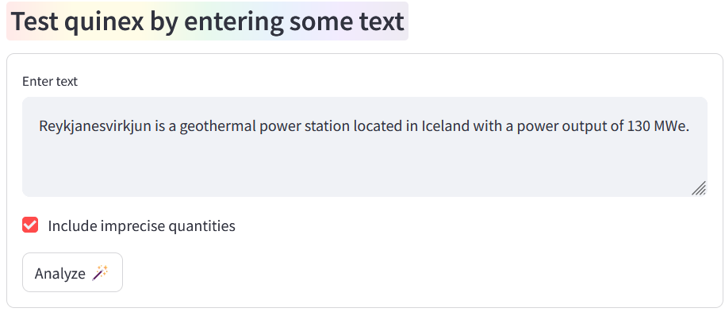
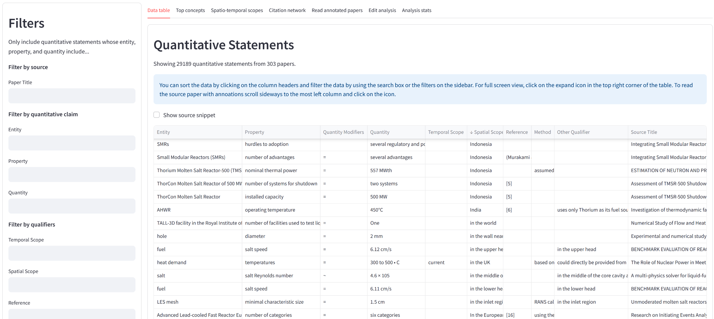
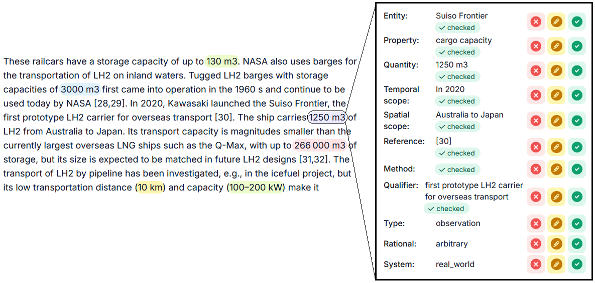

# Paper processing service

Use Quinex as part of a self-hosted web service to process scientific articles.

> [!WARNING]
> The paper processing service is experimental. We have restructured the code and have not yet fully tested it again.

Quinex was developed to extract quantitative information from scientific articles. Thus, the main use case is to process scientific articles in bulk and analyze the extracted information.

For this purpose, we prototyped a service to create bulk analyses of scientific articles and visualize the results in a dashboard.

**Demo extraction of quantitative information from text**


**Process scientific articles and analyze extracted information in a dashboard**


**Read scientific articles with annotations and curate them**


## Installation
Make sure to install quinex with the `[paper_analysis]` extra to install the required dependencies:
```bash
pip install quinex[paper_analysis]
```

## Setting up the paper processing service

> [!IMPORTANT]
> Please note that the bulk processing API used for the web service is assumed to be deployed on a SLURM cluster as it submits the processing jobs as SLURM jobs to compute nodes. 

If you want to use the web service without a SLURM cluster, you can disable the batch `batch_annotation_service` and `parsing_service` in the [config file](../services/paper_analysis_service/config/config.yml) and skip step 1 and 3. This way, the dashboard can be used with the demo text field, results dashboard, and the reading GUI, but no new analyses can be created.

Also note that analyses can either be saved on disk or in a MongoDB database. However, the implementation for the latter has not been tested for a while and may not work as expected. Thus, we recommend to use the disk option for now.

To run the Quinex paper processing service, you need to set up the following components:

1. **Grobid as PDF parsing service** (converts PDFs into a structured representation)
    ```bash
    podman run --rm --gpus all --init --ulimit core=0 -p 8070:8070 grobid/grobid:0.8.0
    ```
    You can also use docker instead of podman. Make sure to use the port specified in `./services/paper_analysis_service/pdf_parser/grobid.json`.
2. **Quinex API** (used for quick responses when using the demo text field)
    ```bash
    python ./services/quinex_api/api.py --config_path "./services/paper_analysis_service/config/config.yml"
    ```
3. **Bulk processing API** (used for processing paper processing jobs on a SLURM cluster)
    ```bash
    python ./services/paper_analysis_service/api/quinex_processing_apis/on_demand_batch_processing_api/headnode_api.py --config_path "./services/paper_analysis_service/config/config.yml"    
    ```
4. **Paper analysis API** (provides endpoints to process scientific articles): Currently, the Nominatim API is used for normalizing the spatial scope. To comply with their API guidelines, you have to specify your email address.
    ```bash
    export EMAIL_ADDRESS="j.doe@example.com"
    ```
 
    If you want to consider XMLs from Elsevier, you have to set your Elsevier API key as an environment variable. You can read the terms and get an API key at https://dev.elsevier.com/apikey/manage.
    ```bash
    export ELSEVIER_API_KEY="<your_api_key>"
    ```
    Then start the paper analysis API:
    ```bash
    cd services/paper_analysis_service/api
    python -m manage_analyses_api.api
    ```
5. **Reading and curation GUI** (visualizes the extracted information directly in the text and provides an interface to curate the training data):
    ```bash
    cd services/paper_analysis_service/ui/reading_and_curation_ui
    sudo docker compose -f docker-compose-dev.yml up -d --build
    ```
    Make sure to use the port specified in `./services/paper_analysis_service/config/config.yml`.
6. **Dashboard** (links everything together to provide a user interface to create analyses and visualize the results)
    ```bash
    streamlit run ./services/paper_analysis_service/ui/analyses_dashboard/index.py --server.port 8501
    ```
    Visit `http://localhost:8501` in your browser to access the dashboard.


## Advanced setup using a server and SLURM cluster
In case you want to set up the web service on a server and use a SLURM cluster for the compute-intensive tasks, follow the steps below.

The setup described here assumes that the parsing and extraction service are deployed on a SLURM cluster
and the API and dashboard from this repository are deployed on another server.
Always replace the IP addresses and usernames with yours and only set up the SSH tunnels if you have a similar setup.

### Setup Grobid parsing service
From cluster headnode, start the PDF parsing service with SLURM if it is not already running
```bash
sbatch services/paper_analysis_service/pdf_parser/start_parsing_service_on_gpu_node.sh
```
or `ssh` on a compute node and start the PDF parsing service directly using the command from step 1 above.

### Setup quinex processing APIs
Quinex has two processing APIs. The first one is running in background on a single GPU on a compute node and is used for quick responses when using the demo text fields etc. On cluster headnode, check if the annotation service is running on the compute node, if not start it:
```bash
sbatch services/paper_analysis_service/api/quinex_processing_apis/background_api/start_background_service_on_gpu_node.sh
```
The second one is running on the headnode and waits for batch jobs. If it recieves a batch job, it creates SLURM jobs to process it. For each SLURM job the models have to be first loaded into memory which takes around 
one to a few minutes. On cluster headnode, start the batch processing annotation API (note the `nohup` to keep it running after logging out):
```bash
nohup uvicorn src.quinex.inference.api.headnode_api:app --reload --port 5050 &
```

### Setup SSH tunnels
Because the quinex API and dashboard are running on a different machine than the parsing and processing services, you need to set up SSH tunnels to forward the requests from the API to the services running on the cluster.

On the virtual machine, create a tunnel to the headnode:
```bash
ssh -L 5050:localhost:5050 username@cluster_headnode
```
Replace `5050` with the port the batch processing API is running on if you changed it in the config file.

Wait until all jobs are active...

Then, on the virtual machine, create a tunnel through the headnode to the annotation service:
```bash
ssh -L 5000:127.0.0.1:9999 username@cluster_headnode ssh -L 9999:127.0.0.1:5000 -N username@compute_node_a
```
Replace `5000` with the port the annotation service is running on if you changed it in the config file.

Analogously, create a tunnel through the headnode to the Grobid parsing service:
```bash
ssh -L 8070:127.0.0.1:9998 username@cluster_headnode ssh -L 9998:127.0.0.1:8070 -N username@compute_node_b
```
Replace `8070` with the port Grobid is running on if you changed it in the config file.

### Start paper processing service
Now you can start the paper processing API, dashboard, and GUI on the virtual machine. Simply, follow steps 4-6 from above. 

## Troubleshooting
* If you port forwarding fails with a message like "Port forwarding is disabled to avoid man-in-the-middle attacks.", open the `.ssh/known_hosts` file on the cluster and remove the line with the IP address of the machine you are trying to connect to. Then try again.
* If port forwarding fails, because the port is already in use, you can modify the command to use a different port.
* You can test if podman can access the GPUs using nvidia-smi and a CUDA image
    ```bash
    podman run --rm --gpus all nvidia/cuda:11.0.3-base-ubuntu20.04 nvidia-smi
    ```
* You can test Grobid by sending a PDF to the service
    ```bash
    curl -v --form input=@/path/to/a/pdf/test.pdf localhost:8070/api/processFulltextDocument
    ```
* You can test if the quinex API, bulk processing API, and paper analysis API are running by sending following request:
    ```bash
    curl -X 'GET' 'http://localhost:{port}/api/is_alive/' -H 'accept: application/json'
    ```
