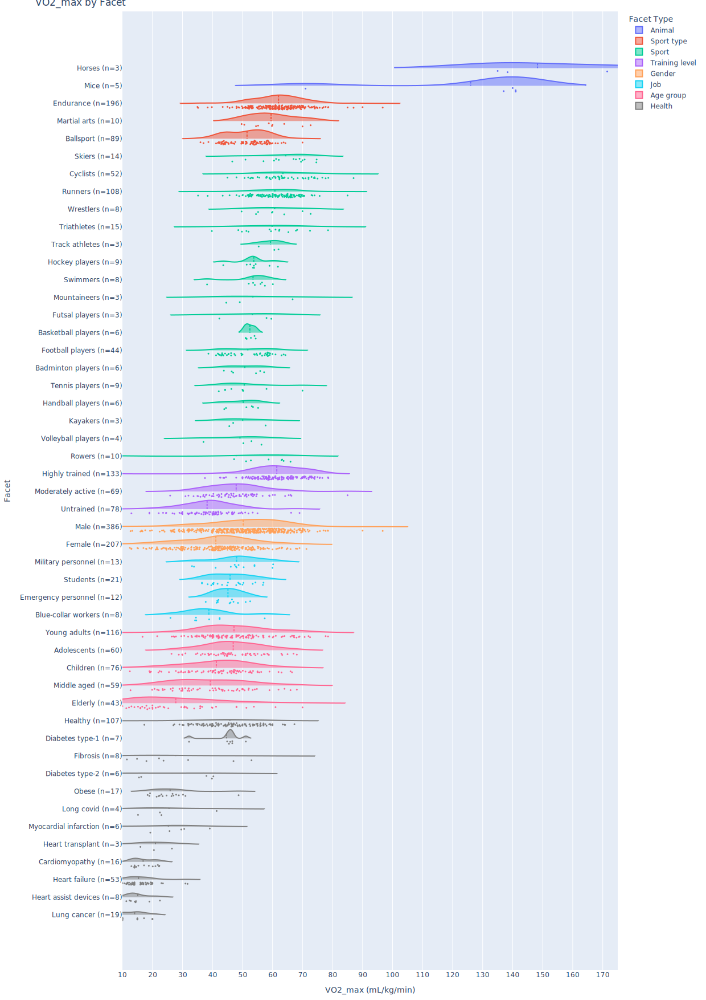
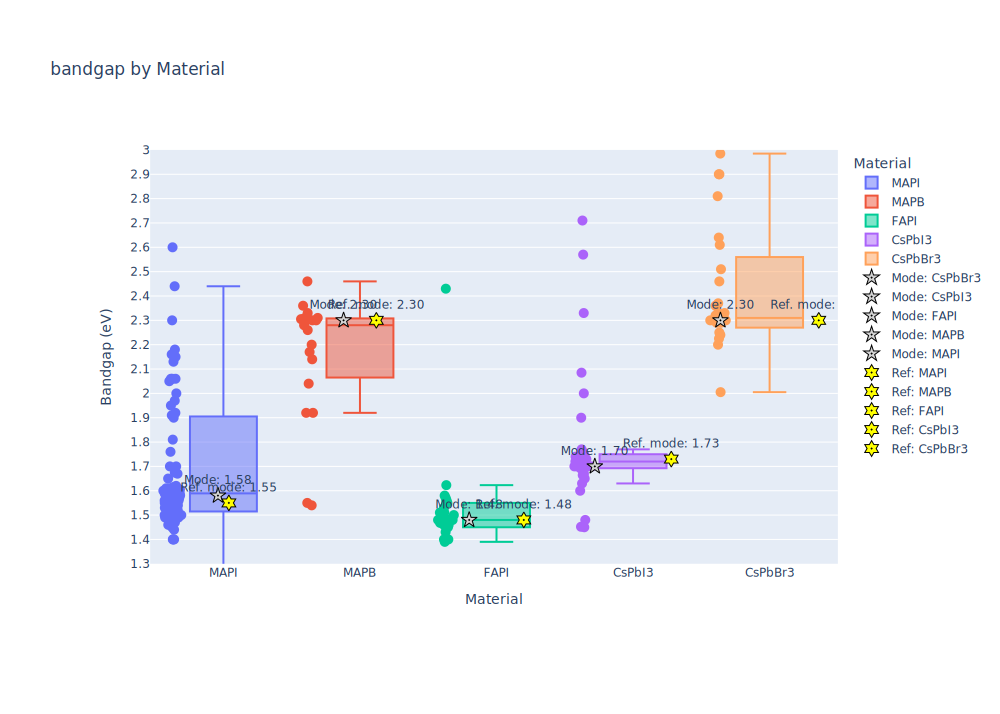

# Code used to create the example plots in the paper

Please note that these examples are not meant to be comprehensive or scientifically rigorous. They are merely examples that demonstrate how to extract data from scientific literature.

To re-create any of the plots:
1. Download abstracts to analyze from [Scopus](www.scopus.com) using the query in the respective folder. Make sure to save the data as a CSV file with columns "Title" and "Abstract". 
2. Run script to extract the data (`submit_extract_data.sh`)
3. The results can then be analyzed and visualized using the respective plotting script (e.g., `./perovskite_bandgaps/plot_bandgap_data.py`). For this, adapt the paths at the beginning of the script. For analyses that require mapping location descriptions to geocoordinates, you need an LLM client and API key. For the examples, we used models provided via blablador by Helmholtz AI Jülich and matching [Python bindings](https://git.geomar.de/everardo-gonzalez/blablador-python-bindings). You will likely need to adapt the model loading part in the plotting scripts to your LLM client of choice.

## Maximal oxygen consumption (V̇O2_max) of humans and animals

## Locations and magnitudes of earthquakes

## Bandgaps of perovskite materials

## Levelized cost of electricity of energy technologies
